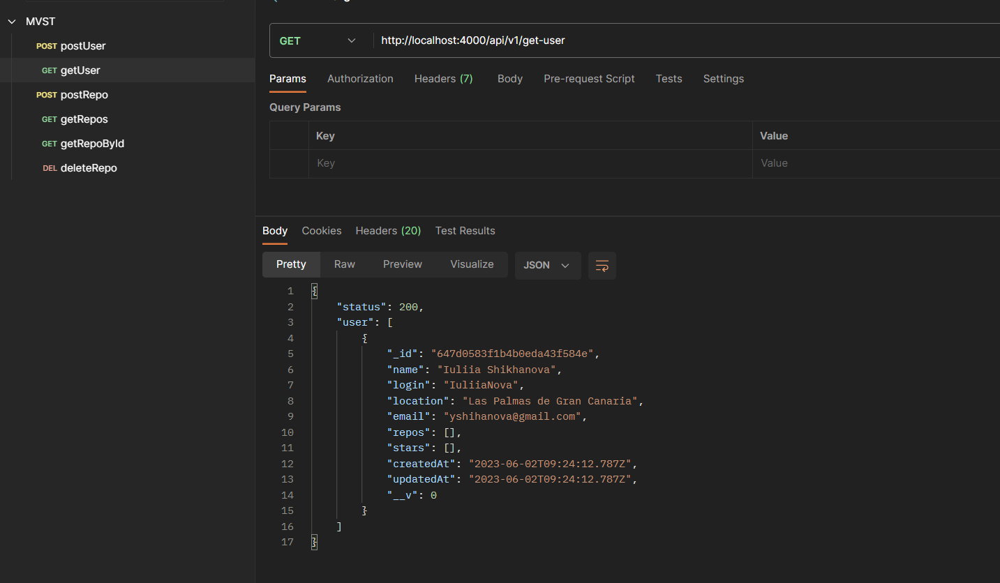

# BACKEND GitHub CLONE

## Project Description
This project aims to create a user-friendly interface for displaying GitHub repositories and implementing a search functionality to filter repositories by name. The application fetches repositories per user and presents them in a well-designed, responsive interface.

GitHub repositories, though simple in concept, are an essential component for managing and showcasing code projects. This project adds value by offering a streamlined and intuitive user experience, taking inspiration from popular apps and the GitHub interface itself. The design principles of good user experience are followed to ensure a pleasant and efficient browsing experience for users.

This is a MERN Web-first progect.


## Key features of the application:

- Show reposotories by User: get all repositories from data base and display them,


- Find by name: in a search bar you can search repository that you want (the result will be get after put 3 simbols in a search bar),


- Filtering by type: All, public, private,


- Filtering by Language: All, JavaScript, TypeScript, PHP,


- Sorting by Name (A-Z) or Last updated (for default the orden is A-Z),


## System Requirements
To run the application in your local environment, make sure you have the following installed:

**Node.js** (version 12 or higher)
**NPM** (Node Package Manager) or Yarn
**MongoDB**

## Environment Setup
Follow the steps below to set up the development environment:

1. Clone the project repository from GitHub: git clone **https://github.com/IuliiaNova/github-clone-node.git**
2. Navigate to the project's root directory: cd backend
3. Install the project dependencies using NPM or Yarn: ``npm install or yarn install``

## Configuration
Before running the application, you need to configure the environment variables. Create a .env file in the root directory of the backend project and provide the following variables:

```
API_VERSION={}
IP_SERVER={}
PORT_MONGO_DB={}
DB_NAME={}
PORT_SERVER={}

```

+ Check cors in ``./src/server.js``,  if your have different localhost add your one

## MongoDB

in this project I have used MongoDB. There are two documents inside:
1. users
   - User has key **repos**, that is an array with all repos that were created by this User

   

2. repos
  - Every repository has userId (owner)

   

## SEEDERS

For development I have created a seeders for basic User and Repositories

**How to use:**

- Run your server with ``npm run dev``
- Open MongoDB Compass and press "connect"
- Ensure that you have got correct the basic user and repositories
- Then go to ``src/db_seeder/user.seeder`` and **delete the comment of lines 16-27**


- Go to MongoDB Compass and check if User has received report Is correct
- Comment again **lines 16-27** ``src/db_seeder/user.seeder``


## Project Structure

|
├── controllers      // Contains the route handlers and business logic
├── middleware       // Contains middleware functions
├── models           // Contains the data models and schemas
├── routes           // Contains the API route definitions
└── server.js        // Main entry point of the backend server

### Libraries 

+ "bson" 
+ "cors" 
+ "helmet"
+ "nodemon"

## API Endpoints 

**Repository**

| METHOD | ROUTE                  | DESCRIPTION                      |
| ------ | ---------------------- | -------------------------------- |
| POST   | /post-repo             | Create repository                |
| GET    | /get-repos             | Get all repositoris              |
| GET    | /get-repos/:id         | Get repository by ID             |
| PUT    | /get-repos/:id         | Update selected by ID repository |
| DELETE | /get-repos/:id         | Delete repository by ID          |

**User**

| METHOD | ROUTE                  | DESCRIPTION                 |
| ------ | ---------------------- | ----------------------------|
| POST   | /post-user             | Creat new user or get by ID |
| GET    | /get-user              | Get all users               |


## Future implementations 

- Create login with **Social login with GitHub** or ***Auth0* 
- Implement **middleware** to check if user is logged for functions: create, update and delete repository


## Postman 

For this project I have created a collection in Postman with the CRUD for repository and POST, GET for User

**Get users**



**Get all repos**


**Get repo by ID**


**Update repo**


**Delete repo**


## Similar projects

I also ofer you to visit my [GitHub](https://github.com/IuliiaNova) and see my other projects, for example **MERN Fullstack** [Gif Strom](https://github.com/IuliiaNova/gif-storm-node.git) where you can find, share and upload gifs.


### Contact
If you have any questions or inquiries related to the project, feel free to contact us via the following email address: **yshihanova@gmail.com**

## Author ✨
<table>
  <td align="center">
    <a href="https://github.com/IuliiaNova">
      
      <br />
      <sub>
      <b>Iuliia Shikhanova</b>
      </sub>
    </a>
    <br />
    <a href="#code-luliianova" title="code-tools-maintenance-design">💻🔧🚧🎨</a>
  </td>
  </tr>
  </table>
